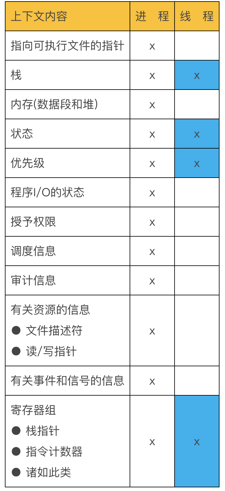

## 目录

[TOC]

## 一、实验目的

实验7的实验目的:

1. 完善实验6中的二状态进程模型，实现五状态进程模型，从而使进程可以分工合作，并发运行。
2. 了解派生进程、结束进程、阻塞进程等过程中父、子进程之间的关系和分别进行的操作。
3. 理解原语的概念并实现进程控制原语do_fork(), do_exit(), do_wait(), wakeup, blocked。

## 二、特色简介

本次实验七又是我对原型操作系统的一次巨大改进，有以下功能实现：

1. 实现了完善的基于二级页表的**页式内存管理**，包括完成了分页机制的开启、编写了处理物理内存的页框式分配和回收、页目录和页表初始化、物理地址和虚拟地址的映射和解映射的内核函数。
2. 利用保护模式的**特权级转移**和TSS，实现了在进程中**分离用户栈和内核栈**。
3. 基于页表和特权级转移彻底重写了进程管理机制。从而实现了：
   1. **fork**系统调用：生成拥有不同虚拟地址空间，资源隔离的，真正意义上的**进程**；
   2. **clone**系统调用：生成共享数据段和代码段地址空间，但拥有不同的栈空间的**线程**；
   3. wait，exit系统调用和sys_do_wait**, **sys_do_sleep**,**wakeup三个内核原语。
4. 重写了exec系统调用，实现了读取加载**ELF**文件。
5. 将shell分离出了内核，变为用户程序，为之后实现多终端打下了基础。

与实验六的代码相比，我共修改了50个文件，新增代码2449行，删除代码1134行。当前总代码量6032行。

（统计数据由git和cloc生成，如下图。图中显示了每个文件的改动情况：）


## 三、实验环境

本次实验中我用到了readelf工具研究elf文件结构，用到了strip工具移除elf文件中的调试信息，从而减少elf文件大小，方便我的操作系统加载。

其余环境与之前实验大致相同：

IDE：CLion 2018.2

C++编译器：g++ 7.3.0，Target: i386-elf

链接器：ld 2.30

二进制文件分析器：objdump 2.30

符号分析器：nm 2.3.0

主机操作系统：Mac OS 10.12

编辑器：Vim 8.0.1400、VS Code 1.21.0

汇编器：Nasm 2.13.02

虚拟机、调试器：Bochs 2.6.9

版本控制：Git 2.15.1

自动构建：GNU Make 3.8.1

## 四、实验方案

### (1). 页式内存管理

#### 1. 页框式物理内存分配器

该部分实现在./kernel_lib/ram.cpp中

80386硬件支持基于二级页表的页式内存管理，支持从线性地址到物理地址的转换。在开始实现这一点之前，首先我们实现以下两点，把物理内存管理起来

1. 知道有多少物理内存，可以分成多少页
2. 实现分配出去（alloc）和回收（free）

获取物理内存情况是通过在实模式时使用BIOS中断完成的，在实验六中已经实现了。

在得知可用内存字节数后，除以4Kb得到页框数$n$。使用一个堆栈pm_node进行管理，初始化pm_node中压入所有可用的物理内存地址，此时栈大小pm_node_size = $n$。alloc函数可以实现为对于pm_node的出栈操作。free函数则实现为对pm_node的入栈操作。

```c++
uint32_t ram_alloc()
{
    if(pm_node_size == 0)
    {
        debug_printf("No memory\n");
        bochs_break();
        return 0;
    }
    debug_printf("Give you physical memory %x\n", pm_node[pm_node_size - 1]);
    memset((char*)pm_node[pm_node_size - 1], 0, PAGE_SIZE);
    return pm_node[--pm_node_size];
}

void ram_free(uint32_t addr)
{
    if(addr & 0xfff)
    {
        debug_printf("Can not free 0x%x, which is not 4k-aligned\n", addr);
        bochs_break();
        return;
    }
    pm_node[pm_node_size++] = addr;
    if(pm_node_size + 1 > pm_node_cnt)
    {
        debug_printf("All memory is free!");
        bochs_break();
        return;
    }
}
```

#### 2. 初始化内核页表和开启分页

该部分实现在./kernel_lib/page.cpp中。

该部分分以下步骤实现

##### 1.)在数据段定义内核页目录和内核页表

```c++
//页目录
pde_t pgd_kern[PDE_SIZE]
__attribute__((aligned(PAGE_SIZE)));
//页表项
static pte_t pte_kern[PTE_COUNT][PTE_SIZE] __attribute__((aligned(PAGE_SIZE)));
```

注：

- pde和pte分别是page directory entry和page table entry的缩写
- 页目录大小一定是4KB（一页的大小） 
- 页表项数目可以按照需求，调整PTE_SIZE的大小，目前我设置
- 

### 2. 进程初始化

#### 1. 分配和初始化PCB

#### 2. 初始化进程页表

### 3. 进程管理

#### 1. 进程调度

#### 2. fork系统调用

#### 3. clone系统调用 

#### 4. wait系统调用

#### 5. exit系统调用

### 4. 加载ELF文件

#### 1. exec系统调用 

#### 2. 启动Shell

## 五、实验结果

## 六、实验总结

## 七、参考文献



