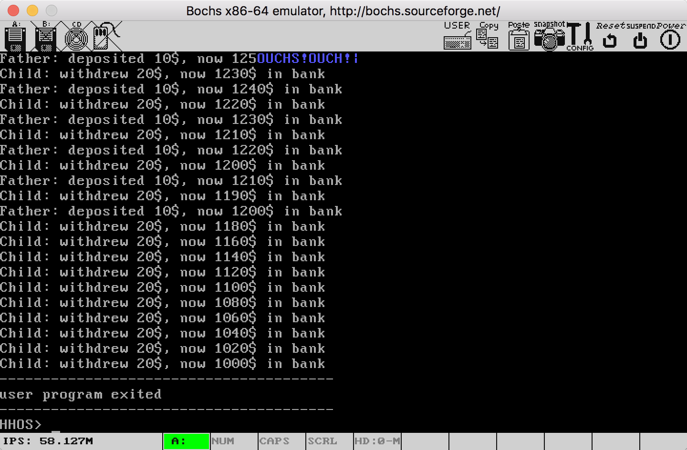
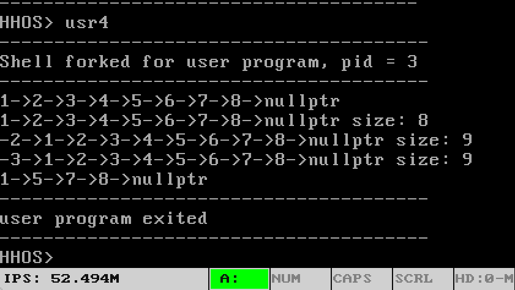

## 目录

[TOC]

## 一、实验目的

在这个项目中，我们完善进程模型

- 多个进程能够利用计数信号量机制实现临界区互斥
- 合作进程在并发时，利用计数信号量，可以按规定的时序执行各自的操作，实现复杂的同步，确保进程并发的情况正确完成使命

## 二、特色简介

本实验在实现了信号量之外，还做了以下三点

1. 利用信号量实现了mutex lock

2. 在实验六的完成页框式物理内存分配和虚拟内存分配的基础上，自下而上，继续完成了**完整的内存管理系统**。本次实验添加的内容包括：

   - 内核中实现了sys_brk和sys_munmap原语，封装了brk和munmap系统调用，用以**给进程分配或回收内存，动态扩展进程占用的内存大小**
   - C语言库中实现了malloc和free
   - 实现了C++的new和delete操作符


整个内存管理系统的结构图如下：


3. 在实现了new和delete的基础上，**实现了动态分配内存的C++单链表类**，能够能够在内存限制内插入任意数量节点，并在析构时自动回收内存，支持链表的深拷贝

## 三、实验环境

与之前实验大致相同：

IDE：CLion 2018.2

C++编译器：g++ 7.3.0，Target: i386-elf

链接器：ld 2.30

二进制文件分析器：objdump 2.30

符号分析器：nm 2.3.0

EFL文件缩小：strip 2.3.0

ELF文件分析：readelf 2.3.0

主机操作系统：Mac OS 10.12

编辑器：Vim 8.0.1400、VS Code 1.21.0

汇编器：Nasm 2.13.02

虚拟机、调试器：Bochs 2.6.9

版本控制：Git 2.15.1

自动构建：GNU Make 3.8.1

## 四、实验方案

### (1). 信号量和互斥锁

#### 1. 信号量的定义

信号量声明为以下数据结构，其中包含一个信号量的值v，信号量是否已经被使用的标志位used，以及等待该信号量的进程的队列的队头指针head

```c++
struct Sem {
    int v;
    bool used;
    PCB* head;
};
```

内核中默认定义100个信号量

```c++
#define NSEM 100
Sem sem[NSEM];
```

#### 2. 信号量的获取

内核实现原语sys_do_getsem，并实现系统调用getsem。sys_do_getsem接收参数v作为信号量初始值。该函数遍历所有信号量，返回第一个找到的used标志位为false的未使用信号量的编号。若所有信号量均被使用了，则返回-1表示获取失败。

```c++
int sys_do_getsem(int v) {
    for(int i = 0; i < NSEM; ++i)
    {
        if(!sem[i].used)
        {
            sem[i].v = v;
            sem[i].used = true;
            debug_printf("sys_do_getsem: give you sem[%d]\n", i);
            return i;
        }
    }
    return -1;
}
```

#### 3. 信号量的P操作

内核实现原语sys_do_p，并实现系统调用p。sys_do_p接收参数sem_id，即要执行p操作的信号量的编号。它首先使用gcc提供的原子操作__sync_fetch_and_sub将信号量的值减一，然后判断信号量的值是否小于0，若小于0，则将当前进程放入该信号量的等待队列中，并使当前进程阻塞。

```c++
int sys_do_p(int sem_id) {
    __sync_fetch_and_sub(&sem[sem_id].v, 1);
    if(sem[sem_id].v < 0)
    {
        current_proc->next = sem[sem_id].head;
        sem[sem_id].head = current_proc;
        sys_do_sleep(&sem[sem_id]);
    }
    return 0;
}
```

#### 4. 信号量的V操作

内核实现原语sys_do_v，并实现系统调用v。sys_do_v接收参数sem_id，即要执行v操作的信号量的编号。它首先使用gcc提供的原子操作__sync_fetch_and_add将信号量的值加一，然后判断信号量的值是否小于等于0，若是，则从等待队列中唤醒一个进程。

```c++
int sys_do_v(int sem_id) {
    __sync_fetch_and_add(&sem[sem_id].v, 1);
    if(sem[sem_id].v <= 0)
    {
        wakeup_one(&sem[sem_id], sem[sem_id].head);
        sem[sem_id].head = current_proc->next;
    }
    return 0;
}
```

#### 5. 信号量的释放

内核实现原语sys_do_freesem，并实现系统调用freesem。sys_do_freesem接收参数sem_id，即要释放的信号量的编号。将该信号量的used为置为false，并重置阻塞队列。

```c++
int sys_do_freesem(int sem_id) {
    sem[sem_id].used = false;
    sem[sem_id].head = nullptr;
    return 0;
}
```

#### 6. 互斥锁的实现

互斥锁可以实现为初始值为1的信号量。这种实现和理论上的互斥锁是有区别的：理论上被锁上互斥锁只能被执行上锁的线程解锁。然而我查询了posix标准，标准提到由非加锁线程执行的解锁操作是undefined behavior。因此使用信号量的互斥锁实现并不违背标准。

>  Calling **pthread_mutex_unlock**() with a **mutex** that the calling thread does not hold will result in undefined behavior.

```
int mutex_get() {
    return getsem(1);
}
void mutex_lock(int lock) {
	p(lock);
}
void mutex_unlock(int lock) {
	v(lock);
}
```

### (2). 动态内存分配

#### 1. 进程内存大小的动态调整

在实验六中，我实现了页框式物理内存分配，以及物理内存到虚拟内存的映射和解映射。但一个进程的内存大小是在它被exec系统调用从磁盘加载到内存时确定好的，无法动态生长（没有heap段）。

本次实验中，我实现了sbrk和munmap两个系统调用。这两个系统调用都是unix/linux标准的系统调用。

sbrk接收一个参数incr，它将调用uvm_alloc，将进程的内存空间扩展至少incr个字节。若incr不是虚拟页大小的整数倍，则向上取整为虚拟页大小的整数倍后再扩展。

```c++
void *sys_sbrk(int len) {
    auto old_size = USER_TEXT_BASE + current_proc->text_size;
    auto new_size = USER_TEXT_BASE + PAGE_ALIGN_UP(current_proc->text_size + len);
    uvm_alloc(current_proc->pgdir, old_size, new_size);
    current_proc->text_size = PAGE_ALIGN_UP(current_proc->text_size + len);
    return (void*)old_size;
}
```

munmap则用于回收进程不再需要使用的物理内存，它接收参数addr和length，代表开始回收的地址和回收的内存大小，这两个值应当与页大小（4KB）对齐。

```c++
int sys_munmap(void *addr, size_t length) {
    for(uint32_t p = PAGE_ALIGN_DOWN((uint32_t)addr); p < PAGE_ALIGN_UP((uint32_t)addr+ length); p += PAGE_SIZE)
    {
        uint32_t pa;
        vmm_get_mapping(current_proc->pgdir, (uint32_t)addr, &pa);
        ram_free(pa);
    }
    return 0;
}
```

#### 2. 实现C语言的内存管理函数

malloc和free是C语言标准的内存管理函数。动态分配给进程的内存空间是以页的大小（4KB）为单位的，然而malloc接收的参数是以字节为单位。因此，malloc要实现自己的用户级内存管理方法。

我的操作系统中移植了开源的liballoc库。它的malloc实现中使用了大内存池和小内存块结合的策略避免频繁的系统调用。并使用链表记录内存分配情况。

内存池是固定为64KB大小的一大块连续内存。内存块则是内存池中任意字节的一部分。在第一次调用malloc分配n个字节的内存时，它首先调用sbrk获取一个内存池。在这次和接下来的调用中，它使用最佳适配(best fit)算法，从这个内存池中找到一个足够大的最小的空闲区分配出去，并使用链表记录每个分配出去的内存块的开始和接收地址。若内存池相对于n个字节不够大，或其中找不到适合的空闲区，将会申请更多的内存池。多个内存池同样也是用链表维护。

malloc过程对链表结构的操作是临界区代码，利用到了刚刚实现的互斥锁来防止竟态。

free函数删除记录内存块分配情况的链表中的有关记录，仅当一整个内存池均不被使用时才调用munmap向内核归还内存。

#### 3. 实现C++的内存管理函数

C++的标准内存管理方法是使用new和delete操作符。它们虽然是C++的关键字，但实际上是通过调用malloc和free实现的，在我们的操作系统中要使用它们，就必须在全局命名空间中提供它们的重载：

```c++
void *operator new(size_t size) {
    return malloc(size);
}
void *operator new[](size_t size){
    return malloc(size);
}
void operator delete(void *p){
    free(p);
}
void operator delete[](void *p){
    free(p);
}
void operator delete(void * ptr, size_t){
   operator delete(ptr);
}
```

### (3). 实现动态分配内存的C++单链表类

在实现了动态内存分配后，我实现了类似标准库list类的单链表类，类的声明如下：

```c++
struct node {
  int data;
  struct node* next;
  node(int data = 0, struct node* next = nullptr) : 
          data(data), next(next) {}
};
class list {
 private:
  node* head;
  int _size;
 
 public:
  list();
  list(const list&);
  list& operator=(const list&);
  ~list();
  bool empty(void) const;
  int size(void) const;
 public:
  void print(void) const;
  void insert(int position, const int& data);
  void erase(int position);
  void clear(void); 
};
```

其中比较重要的是insert成员函数，它接收参数position和data，调用new node(data)动态分配一个值为data的节点，并插入第position个元素前。

```c++
void list::insert(int position, const int& data)
{
    list_iterator iter = this->head;
    if(position > _size) 
        return;
    else {
        if(head == nullptr) 
            head = new node(data);
        else if(position == 0) {
            node* tmp = new node(data);
            tmp->next = head;
            head = tmp;
        }
        else {
            for(int i = 0; i < position - 1; ++i)
               iter = iter->next;
            node* tmp = new node(data);
            if (iter != nullptr) {
                tmp->next = iter->next;
                iter->next = tmp;
            }
        }
        ++_size;
    }
} 
```

重载了拷贝构造函数，为拷贝出的新链表在内存中构造新的节点，实现了深拷贝

```c++
list& list::operator=(const list& rhs) {
    if (this == &rhs) return *this;
    list_iterator iter = this->head;
    while(iter != nullptr) {
        list_iterator tmp = iter->next;
        delete iter;
        iter = tmp;
    }
    _size = rhs._size;
    const_list_iterator rhs_iter = rhs.head;
    if(rhs_iter != nullptr)
        head = new node(rhs_iter->data);
    rhs_iter = rhs_iter->next;
    list_iterator this_iter = head;
    while (rhs_iter != nullptr) {
        this_iter->next = new node(rhs_iter->data);
        rhs_iter = rhs_iter->next;
        this_iter = this_iter->next;
    }
    return *this;
}
```

## 五、实验结果

### 1.存款取款问题

程序代码如下：（usr/usr3.cpp）

两个线程共享存款金额resource，resource初始值为1000。

一个线程每次存款10元，共存1000次，另一个线程每次取款20元，共取款50次。使用信号量进程线程同步。

```c++
int resource = 1000;
int s;
int n;

void main() {
    s = getsem(1);
    if (clone())
    {
        for(int i = 0; i < 100; ++i)
        {
            p(s);
            resource += 10;
            printf("Father: deposited 10$, now %d$ in bank\n", resource);
            v(s);
        }
    }
    else
    {
        for(int i = 0; i < 50; ++i) {
            p(s);
            resource -= 20;
            printf("Child: withdrew 20$, now %d$ in bank\n", resource);
            v(s);
        }
    }
}
```

实验结果如下：可见在最后，银行存款余额仍为1000元，说明没有出现竞争情况，证明了信号量实现的正确性。

### 2. 测试单链表类

程序代码如下：（usr/usr4.cpp）

首先构造了链表li，进行了以下三个操作：

1. 向li插入1到8，打印出li的所有元素
2. 用li复制构造li2和li3，分别在其表头插入-2，-3。打印出li，li2，li3各自的所有元素和元素总数
3. 删除li中第5，3，2，1个元素，打印出li的所有元素

```c++
int del[] = {5,3,2,1};
extern "C" void main() {
    list li;

    int n = 8;

    for (int i = 0; i < n; i++) {
        li.insert(i, n - i);
    }

    li.print();
    printf("\n");

    list li2(li);
    list li3;

    li = li3 = li2 = li;

    li2.insert(0, -2);
    li3.insert(0, -3);
    li.print();
    printf(" size: %d\n", li.size());
    li2.print();
    printf(" size: %d\n", li2.size());
    li3.print();
    printf(" size: %d\n", li3.size());

    int m = 5;

    for (int i = 0; i < m; i++) {
        li.erase(del[i]);
    }

    li.print();
    printf("\n");
}
```

运行结果如下：可见结果是完全符合预期的。验证了动态内存分配的正确性和单链表类的正确性。



## 六、实验总结

本次实验是7次实验中，**代码量最大**，**理论难度最大**的一个。

首先是为了实现分页，我花了很长时间研究保护模式中各种概念，包括:

- 特权级相关的：DPL、CPL、RPL，一致代码段段，非一致代码段；
- 上下文切换相关的：TSS、TR寄存器；
- 分页相关的：页目录、页表、页表项结构、cr0、cr3寄存器；

这部分是十分底层的，代码上有一个位不对就会引发错误。上一次实验中实现的“蓝屏”功能就帮到了我许多，因为最初的代码几乎总是引发一般保护错误（general protection error）或者页错误（page fault）的，“蓝屏”功能让我能立即定位到引发错误的代码，而不像实验三时那样从头开始一行一行运行过去（回想起来那真是十分痛苦的）极大帮助了我调试。

开启分页后，我本来打算在实验六的二状态进程模型上改进以适应分页，但发现由于之前的进程代码使用了过多汇编过程，许多地方硬编码了一些偏移量，要移除其中基于段式内存管理的那部分代码很困难，因此最后决定全部删去，参考Unix的代码重写。其实我还是很心痛的，毕竟实验六的进程模型是我通宵连续工作近20小时做出来的成果。

但分页真的是非常有用的。在上次实验报告的总结中，我分析了基于段式内存管理实现多进程时，为了分离不同进程的堆栈，导致ds和ss段地址不同，最终导致C语言函数传参出错的问题；并提出期望通过页式内存管理解决这个问题。本实验中分页确实解决了这一点，每一个用户程序进程都以虚拟地址0xc0001000开始运行，栈顶均是0xc0001000，在用户程序看来内存不再分段，“指哪打哪”，从而符合了C语言抽象机器模型（C abstract machine model）对于平坦内存的假设。我不再需要用我写的那个奇怪的基于模板和内联汇编的my_va_arg，也可以开开心心地在多进程的环境下写用户C程序了。

本次实验让我觉得收获最大的是：通过阅读Unix系统的代码，并在我的系统中加以实现，让我彻底搞懂了Unix系统中的进程生命周期和进程管理有关的函数的工作原理。Unix系统中进程这部分有很多让我觉得比较难搞懂的内容：

- 进入和离开利用中断时的压栈和出栈过程构造中断帧
- 利用特权级切换进行内核栈和用户栈的切换
- 手动创建的init时的内核栈的构造
- 调度器选择进程运行、进程又通过sched返回调度器的多进程调度过程
- 通过fork后用exec替换自身镜像的加载程序方式

但同时，这些内容大都也是设计巧妙，令人学到很多的。

最后，有了分页和基于它重新实现的进程机制，我实现了加载ELF这种广泛应用于主流操作系统的可执行文件。一直以来都让我好奇的问题：“普通文件是用程序打开，那么可执行程序到底是怎么打开的”，也终于得到了比实验二中“直接把二进制文件载入内存”更让我满意的回答。

## 七、参考文献

《x86汇编语言 从实模式到保护模式》，李忠、王晓波、余洁

《Linux内核完全剖析——基于0.12内核》，赵炯

《xv6 中文文档》https://legacy.gitbook.com/book/th0ar/xv6-chinese/details

xv6 OS https://github.com/mit-pdos/xv6-public

OS 67 https://github.com/SilverRainZ/OS67