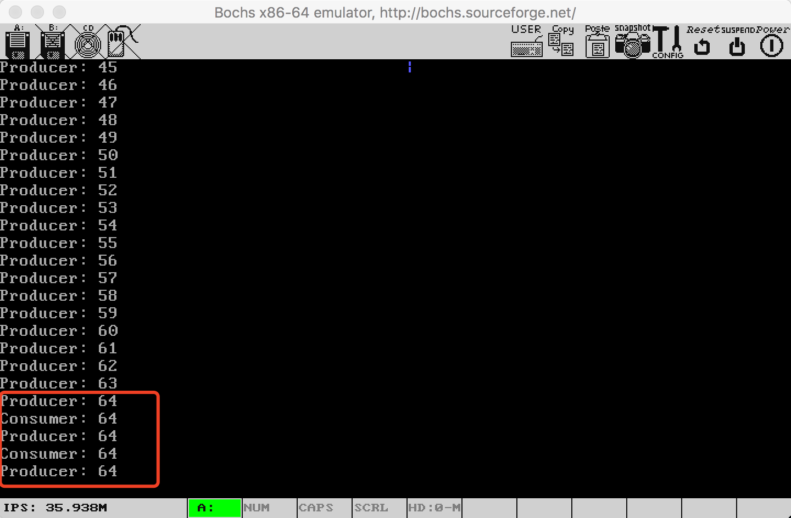

## 目录

[TOC]

## 一、实验目的

在这个项目中，我们完善进程模型

- 多个进程能够利用计数信号量机制实现临界区互斥
- 合作进程在并发时，利用计数信号量，可以按规定的时序执行各自的操作，实现复杂的同步，确保进程并发的情况正确完成使命

## 二、特色简介

本实验在实现了信号量之外，还做了以下三点

1. 利用信号量实现了mutex lock

2. 在实验六的完成页框式物理内存分配和虚拟内存分配的基础上，自下而上，继续完成了**完整的内存管理系统**。本次实验添加的内容包括：

   - 内核中实现了sys_brk和sys_munmap原语，封装了brk和munmap系统调用，用以**给进程分配或回收内存，动态扩展进程占用的内存大小**
   - C语言库中实现了malloc和free
   - 实现了C++的new和delete操作符


整个内存管理系统的结构图如下：


3. 在实现了new和delete的基础上，**实现了动态分配内存的C++单链表类**，能够能够在内存限制内插入任意数量节点，并在析构时自动回收内存，支持链表的深拷贝
4. 实现了三个进程同步机制问题的演示程序：
   1. **存取款问题**：保证在一系列存取款操作后存款金额和初始金额一致。
   2. **生产者消费者问题**：**通过绘制时序图证明了**课本提供单个生产者和单个消费者的生产者消费者问题的解法，总会出现生产者和消费者交替执行，一个产品被生产出来后，就立即被消耗掉的时序。
   3.  **读者写者问题**：使用读者优先算法，验证并分析了读者优先算法会造成的写者饥饿情况。

## 三、实验环境

与之前实验大致相同：

IDE：CLion 2018.2

C++编译器：g++ 7.3.0，Target: i386-elf

链接器：ld 2.30

二进制文件分析器：objdump 2.30

符号分析器：nm 2.3.0

EFL文件缩小：strip 2.3.0

ELF文件分析：readelf 2.3.0

主机操作系统：Mac OS 10.12

编辑器：Vim 8.0.1400、VS Code 1.21.0

汇编器：Nasm 2.13.02

虚拟机、调试器：Bochs 2.6.9

版本控制：Git 2.15.1

自动构建：GNU Make 3.8.1

## 四、实验方案

### (1). 信号量和互斥锁

#### 1. 信号量的定义

信号量声明为以下数据结构，其中包含一个信号量的值v，信号量是否已经被使用的标志位used，以及等待该信号量的进程的队列的队头指针head

```c++
struct Sem {
    int v;
    bool used;
    PCB* head;
};
```

内核中默认定义100个信号量

```c++
#define NSEM 100
Sem sem[NSEM];
```

#### 2. 信号量的获取

内核实现原语sys_do_getsem，并实现系统调用getsem。sys_do_getsem接收参数v作为信号量初始值。该函数遍历所有信号量，返回第一个找到的used标志位为false的未使用信号量的编号。若所有信号量均被使用了，则返回-1表示获取失败。

```c++
int sys_do_getsem(int v) {
    for(int i = 0; i < NSEM; ++i)
    {
        if(!sem[i].used)
        {
            sem[i].v = v;
            sem[i].used = true;
            debug_printf("sys_do_getsem: give you sem[%d]\n", i);
            return i;
        }
    }
    return -1;
}
```

#### 3. 信号量的P操作

内核实现原语sys_do_p，并实现系统调用p。sys_do_p接收参数sem_id，即要执行p操作的信号量的编号。它首先使用gcc提供的原子操作__sync_fetch_and_sub将信号量的值减一，然后判断信号量的值是否小于0，若小于0，则将当前进程放入该信号量的等待队列中，并使当前进程阻塞。

```c++
int sys_do_p(int sem_id) {
    __sync_fetch_and_sub(&sem[sem_id].v, 1);
    if(sem[sem_id].v < 0)
    {
        current_proc->next = sem[sem_id].head;
        sem[sem_id].head = current_proc;
        sys_do_sleep(&sem[sem_id]);
    }
    return 0;
}
```

#### 4. 信号量的V操作

内核实现原语sys_do_v，并实现系统调用v。sys_do_v接收参数sem_id，即要执行v操作的信号量的编号。它首先使用gcc提供的原子操作__sync_fetch_and_add将信号量的值加一，然后判断信号量的值是否小于等于0，若是，则从等待队列中唤醒一个进程，将其设置为就绪态。

```c++
int sys_do_v(int sem_id) {
    __sync_fetch_and_add(&sem[sem_id].v, 1);
    if(sem[sem_id].v <= 0)
    {
        wakeup_one(&sem[sem_id], sem[sem_id].head);
        sem[sem_id].head = current_proc->next;
    }
    return 0;
}
```

#### 5. 信号量的释放

内核实现原语sys_do_freesem，并实现系统调用freesem。sys_do_freesem接收参数sem_id，即要释放的信号量的编号。将该信号量的used为置为false，并重置阻塞队列。

```c++
int sys_do_freesem(int sem_id) {
    sem[sem_id].used = false;
    sem[sem_id].head = nullptr;
    return 0;
}
```

#### 6. 互斥锁的实现

互斥锁可以实现为初始值为1的信号量。这种实现和理论上的互斥锁是有区别的：理论上被锁上互斥锁只能被执行上锁的线程解锁。然而我查询了posix标准，标准提到由非加锁线程执行的解锁操作是undefined behavior。因此使用信号量的互斥锁实现并不违背标准。

>  Calling **pthread_mutex_unlock**() with a **mutex** that the calling thread does not hold will result in undefined behavior.

```
int mutex_get() {
    return getsem(1);
}
void mutex_lock(int lock) {
	p(lock);
}
void mutex_unlock(int lock) {
	v(lock);
}
```

### (2). 动态内存分配

#### 1. 进程内存大小的动态调整

在实验六中，我实现了页框式物理内存分配，以及物理内存到虚拟内存的映射和解映射。但一个进程的内存大小是在它被exec系统调用从磁盘加载到内存时确定好的，无法动态生长（没有heap段）。

本次实验中，我实现了sbrk和munmap两个系统调用。这两个系统调用都是unix/linux标准的系统调用。

sbrk接收一个参数incr，它将调用uvm_alloc，将进程的内存空间扩展至少incr个字节。若incr不是虚拟页大小的整数倍，则向上取整为虚拟页大小的整数倍后再扩展。

```c++
void *sys_sbrk(int len) {
    auto old_size = USER_TEXT_BASE + current_proc->text_size;
    auto new_size = USER_TEXT_BASE + PAGE_ALIGN_UP(current_proc->text_size + len);
    uvm_alloc(current_proc->pgdir, old_size, new_size);
    current_proc->text_size = PAGE_ALIGN_UP(current_proc->text_size + len);
    return (void*)old_size;
}
```

munmap则用于回收进程不再需要使用的物理内存，它接收参数addr和length，代表开始回收的地址和回收的内存大小，这两个值应当与页大小（4KB）对齐。

```c++
int sys_munmap(void *addr, size_t length) {
    for(uint32_t p = PAGE_ALIGN_DOWN((uint32_t)addr); p < PAGE_ALIGN_UP((uint32_t)addr+ length); p += PAGE_SIZE)
    {
        uint32_t pa;
        vmm_get_mapping(current_proc->pgdir, (uint32_t)addr, &pa);
        ram_free(pa);
    }
    return 0;
}
```

#### 2. 实现C语言的内存管理函数

malloc和free是C语言标准的内存管理函数。动态分配给进程的内存空间是以页的大小（4KB）为单位的，然而malloc接收的参数是以字节为单位。因此，malloc要实现自己的用户级内存管理方法。

我的操作系统中移植了开源的liballoc库。它的malloc实现中使用了大内存池和小内存块结合的策略避免频繁的系统调用。并使用链表记录内存分配情况。

内存池是固定为64KB大小的一大块连续内存。内存块则是内存池中任意字节的一部分。在第一次调用malloc分配n个字节的内存时，它首先调用sbrk获取一个内存池。在这次和接下来的调用中，它使用最佳适配(best fit)算法，从这个内存池中找到一个足够大的最小的空闲区分配出去，并使用链表记录每个分配出去的内存块的开始和接收地址。若内存池相对于n个字节不够大，或其中找不到适合的空闲区，将会申请更多的内存池。多个内存池同样也是用链表维护。

malloc过程对链表结构的操作是临界区代码，利用到了刚刚实现的互斥锁来防止竟态。

free函数删除记录内存块分配情况的链表中的有关记录，仅当一整个内存池均不被使用时才调用munmap向内核归还内存。

#### 3. 实现C++的内存管理函数

C++的标准内存管理方法是使用new和delete操作符。它们虽然是C++的关键字，但实际上是通过调用malloc和free实现的，在我们的操作系统中要使用它们，就必须在全局命名空间中提供它们的重载：

```c++
void *operator new(size_t size) {
    return malloc(size);
}
void *operator new[](size_t size){
    return malloc(size);
}
void operator delete(void *p){
    free(p);
}
void operator delete[](void *p){
    free(p);
}
void operator delete(void * ptr, size_t){
   operator delete(ptr);
}
```

### (3). 实现动态分配内存的C++单链表类

在实现了动态内存分配后，我实现了类似标准库list类的单链表类，类的声明如下：

```c++
struct node {
  int data;
  struct node* next;
  node(int data = 0, struct node* next = nullptr) : 
          data(data), next(next) {}
};
class list {
 private:
  node* head;
  int _size;
 
 public:
  list();
  list(const list&);
  list& operator=(const list&);
  ~list();
  bool empty(void) const;
  int size(void) const;
 public:
  void print(void) const;
  void insert(int position, const int& data);
  void erase(int position);
  void clear(void); 
};
```

其中比较重要的是insert成员函数，它接收参数position和data，调用new node(data)动态分配一个值为data的节点，并插入第position个元素前。

```c++
void list::insert(int position, const int& data)
{
    list_iterator iter = this->head;
    if(position > _size) 
        return;
    else {
        if(head == nullptr) 
            head = new node(data);
        else if(position == 0) {
            node* tmp = new node(data);
            tmp->next = head;
            head = tmp;
        }
        else {
            for(int i = 0; i < position - 1; ++i)
               iter = iter->next;
            node* tmp = new node(data);
            if (iter != nullptr) {
                tmp->next = iter->next;
                iter->next = tmp;
            }
        }
        ++_size;
    }
} 
```

重载了拷贝构造函数，为拷贝出的新链表在内存中构造新的节点，实现了深拷贝

```c++
list& list::operator=(const list& rhs) {
    if (this == &rhs) return *this;
    list_iterator iter = this->head;
    while(iter != nullptr) {
        list_iterator tmp = iter->next;
        delete iter;
        iter = tmp;
    }
    _size = rhs._size;
    const_list_iterator rhs_iter = rhs.head;
    if(rhs_iter != nullptr)
        head = new node(rhs_iter->data);
    rhs_iter = rhs_iter->next;
    list_iterator this_iter = head;
    while (rhs_iter != nullptr) {
        this_iter->next = new node(rhs_iter->data);
        rhs_iter = rhs_iter->next;
        this_iter = this_iter->next;
    }
    return *this;
}
```

## 五、实验结果

### 1.存款取款问题

程序代码如下：（usr/usr3.cpp）

两个线程共享存款金额resource，resource初始值为1000。

一个线程每次存款10元，共存1000次，另一个线程每次取款20元，共取款50次。使用信号量进程线程同步。

```c++
int resource = 1000;
int s;
int n;

void main() {
    s = getsem(1);
    if (clone())
    {
        for(int i = 0; i < 100; ++i)
        {
            p(s);
            resource += 10;
            printf("Father: deposited 10$, now %d$ in bank\n", resource);
            v(s);
        }
    }
    else
    {
        for(int i = 0; i < 50; ++i) {
            p(s);
            resource -= 20;
            printf("Child: withdrew 20$, now %d$ in bank\n", resource);
            v(s);
        }
    }
}
```

实验结果如下：可见在最后，银行存款余额仍为1000元，说明没有出现竞争情况，证明了信号量实现的正确性。

### 2. 生产者消费者问题

按照课本Figure 5.11的解法， 我实现了生产者消费者问题的演示程序，代码如下：（usr/usr2.cpp）

程序中分别有一个生产者和一个消费者，初始资源为0，无资源上限，信号量s实现了两个线程对资源的读写操作的互斥，信号量n用于对资源计数，它的数值恰好是剩余资源数。

```c++
int resource = 0;
int s;
int n;

void main() {
    s = getsem(1);
    n = getsem(0);
    if (clone())
    {
        //Consumer
        while (1) {
            p(n);
            p(s);
            printf("Consumer: %d\n", resource);
            --resource;
            v(s);
        }
    }
    else
    {
        //Producer
        while (1) {
            p(s);
            ++resource;
            printf("Producer: %d\n", resource);
            v(s);
            v(n);
        }
    }
}
```

程序某一次执行截图如下：



通过多次执行观察到，程序在执行一段时间后总会出现一种情况：生产者和消费者交替执行，生产者每生产一个资源就会立即被消耗掉（如上图红框中的情况）。我对这种现象进行了研究，绘制出了这种情况下的时序图：


如上图所示，这种时序的触发条件是：

1. 在某一时刻（初始时刻恰好是符合这个条件的一个时刻）n = 0， s = 1。接下来：
2. 消费者被调度执行，对n进行P操作导致自己被阻塞，进程切换到生产者。
3. 生产者执行，在生产了资源后消费者被唤醒，但还未被调度到。
4. 在某一时刻，生产者对s执行完P操作后，时钟中断发生，进程切换到已经处于就绪态的消费者。

接下来：

1. 消费者也对s执行P操作，结果s小于0，消费者又被阻塞，进程切换到生产者。
2. 生产者对s执行V操作，消费者进入就绪态
3. 生产者生产资源
4. 生产者对s执行P操作，自己被阻塞，进程切换到消费者
5. 消费者对s执行V操作，生产者进入就绪态
6. 消费者消耗资源
7. 回到状态1，循环往复

随着程序执行时间的增加，程序遇到上述条件因而到达这种时序的概率趋近于1，因此几乎总会出现这种生产一个就消耗一个的状态。

这种时序关系有利于消费者及时利用产出，但生产者在此之前多生成的资源不会被消耗了，这是我担心并研究这个问题的原始目的。但后来发现，浪费的资源的数量上限仅仅是生产者在一个时钟调度的时间片中生产出的资源数。在实际系统中生产者在一个时钟片中能生产的资源是很有限的，因此在工程上并没有太大影响。

### 3. 读者写者问题

按照课本Figure 5.22的解法， 我实现了读者优先的读者写者问题的演示程序，程序中共3个读者，一个写者，写者每次向缓冲区写一个A，共写入10个，读者读出缓冲区内容，如果发现读到了10个字母A就停下来。代码如下：（usr/usr1.cpp）

```c++
int reader_count = 0;
int reader_sem;
int writer_sem;
char buf[21];
int ptr = 0;
void reader(int id)
{
    bool stop = false;
    while (!stop)
    {
        p(reader_sem);
        reader_count++;
        printf("Reader %d entered, %d readers in total\n", id, reader_count);
        if(reader_count == 1)
            p(writer_sem);
        v(reader_sem);
        printf("Reader %d start reading: %s\n", id, buf);
        if(strlen(buf) >= 10)
            stop = true;
        p(reader_sem);
        reader_count--;
        printf("Reader %d left, %d readers stays\n", id, reader_count);
        if(reader_count == 0)
            v(writer_sem);
        v(reader_sem);
    }
}
extern "C" void main()
{
    reader_sem = getsem(1);
    writer_sem = getsem(1);

    if(clone())
    {
        reader(1);
        wait();
    }
    else if(clone())
    {
        reader(2);
        wait();
    }
    else if(clone())
    {
        reader(3);
        wait();
    }
    else
    {
        while (ptr < 10)
        {
            p(writer_sem);
            buf[ptr] = 'A';
            int n = 100000;
            while (n--);
            printf("Writer: wrote 'A' to buffer\n");
            ++ptr;
            v(writer_sem);
        }
        printf("Writer finished his work\n");
        wait();
    }
}
```

正如课本所述，读者优先算法是有让写者饥饿的风险的。

测试结果中，程序有时正常执行并很快退出（如下面第一张图）。

有时则会出现写者饥饿现象（如下面第二张图）

这个例子中读者2和读者3不断交替执行，通过我输出在bochs控制台的调试信息（下图三）可以分析这种饥饿出现的原因是：某一时刻3个读者均进入，此时reader_sem值为-2。读者3作为唯一的就绪进程，它的最后一条指令v(reader_sem)执行完后，reader_sem只能恢复到-1，然后立即执行p(reader_sem)使得自身被阻塞，reader_sem又变为-2，另一个读者被调度到，又重复这个过程。


（图一）


（图二）


（图三）

### 4. 测试单链表类

程序代码如下：（usr/usr4.cpp）

首先构造了链表li，进行了以下三个操作：

1. 向li插入1到8，打印出li的所有元素
2. 用li复制构造li2和li3，分别在其表头插入-2，-3。打印出li，li2，li3各自的所有元素和元素总数
3. 删除li中第5，3，2，1个元素，打印出li的所有元素

```c++
int del[] = {5,3,2,1};
extern "C" void main() {
    list li;

    int n = 8;

    for (int i = 0; i < n; i++) {
        li.insert(i, n - i);
    }

    li.print();
    printf("\n");

    list li2(li);
    list li3;

    li = li3 = li2 = li;

    li2.insert(0, -2);
    li3.insert(0, -3);
    li.print();
    printf(" size: %d\n", li.size());
    li2.print();
    printf(" size: %d\n", li2.size());
    li3.print();
    printf(" size: %d\n", li3.size());

    int m = 5;

    for (int i = 0; i < m; i++) {
        li.erase(del[i]);
    }

    li.print();
    printf("\n");
}
```

运行结果如下：可见结果是完全符合预期的。验证了动态内存分配的正确性和单链表类的正确性。


## 六、实验总结

本次实验我的收获非常大。

我是一边复习课本第五章，一边去实现信号量和三个进程同步有关的程序的，边学边做让我对知识的理解更加深刻。生产者消费者和读者写者这两个程序都是课本上有代码，然而只有通过运行，我才发现了生产者和消费者一对一交替执行以及写者饥饿的现象的现象，而对它们这两种情况的分析花费了我很长的时间。这个过程提高了我对并行程序的分析能力，收获到了课本之外的知识。

从我开始实现保护模式，朝着动态内存分配的目标出发，到在本次实验中终于实现一套完整的动态内存分配系统，几乎已经过去了半个学期的时间。从我绘制的结构图可以看出，它自底向上实现为七个层次，这也基本是实际的Linux系统中动态内存管理的实现方式。（当然实际的系统要考虑尽可能优化性能、保证安全可靠，要复杂得多，Linux有11万行以上相关代码）。

这次实验编写的进程同步的演示程序大量使用了实验七完成的进程管理函数，检验了这些函数乃至整个进程框架的正确性。同时，本次实验又为下一次实验提供了方便，通过list类，我能很方便地存储文件系统中的目录、文件记录。

list类的测试程序其实是我大一时程序设计课的作业。本次实验我直接将它编译到我的操作系统中就能正确执行，说实话这是非常振奋人心的，说明我的操作系统已经有一定的实用性了，而文件系统就是它缺少另一个重要部分（或许还有网络系统233）。期待下次实验我能够很好地实现它。

## 七、参考文献

liballoc https://github.com/blanham/liballoc/

系统调用与内存管理（sbrk、brk、mmap、munmap） https://blog.csdn.net/Apollon_krj/article/details/54565768